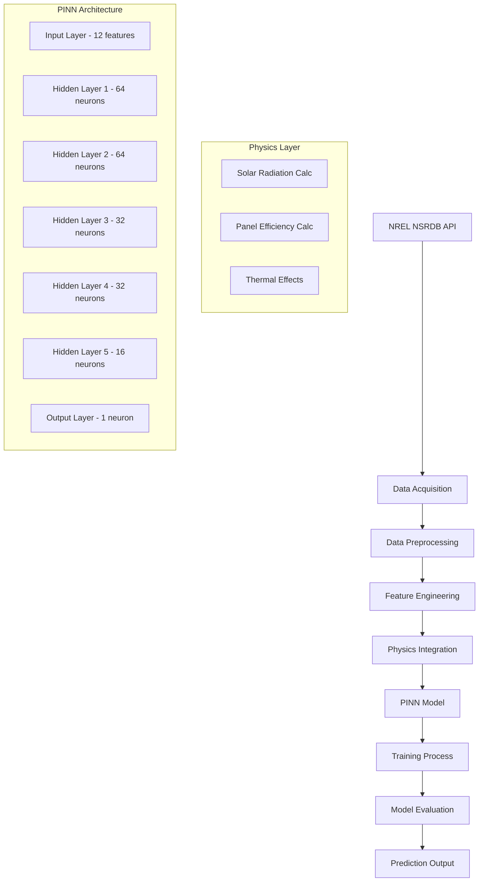

<div align="center">

# Optimasi Prediksi Energi Terbarukan Nasional Berbasis Physics-Informed Neural Network (PINN)

<div align="center">


**Sistem Prediksi Energi Panel Surya Berbasis AI dengan Integrasi Hukum Fisika**

*Mendukung Kemandirian Energi Nasional dan Target Net-Zero Emission Indonesia*

[📖 Dokumentasi](#dokumentasi) • [🌞 Model PINN](#-metodologi-pinn) • [📊 Hasil Penelitian](#-hasil-dan-evaluasi) • [🔗 Referensi](#-referensi-akademik)

</div>

---

<div align="left">

## 📋 Daftar Isi

- [🎯 Executive Summary](#-executive-summary)
- [🔍 Latar Belakang & Masalah](#-latar-belakang--masalah)
- [✨ Fitur Unggulan](#-fitur-unggulan)  
- [🏗️ Arsitektur Sistem](#️-arsitektur-sistem)
- [🚀 Quick Start](#-quick-start)
- [🔧 Instalasi Detail](#-instalasi-detail)
- [📖 Panduan Penggunaan](#-panduan-penggunaan)
- [🔬 Metodologi PINN](#-metodologi-pinn)
- [📊 Hasil dan Evaluasi](#-hasil-dan-evaluasi)
- [🌐 Struktur Repositori](#-struktur-repositori)
- [⚙️ Konfigurasi Lanjutan](#️-konfigurasi-lanjutan)
- [🤝 Kontribusi](#-kontribusi)
- [📚 Referensi Akademik](#-referensi-akademik)
- [📄 Lisensi](#-lisensi)

---

## 🎯 Executive Summary

**Physics-Informed Neural Network (PINN)** untuk prediksi energi panel surya ini merupakan solusi inovatif yang menggabungkan kecerdasan buatan dengan hukum fisika fundamental. Sistem ini dirancang khusus untuk mengatasi tantangan intermittency energi surya di Indonesia dan mendukung stabilitas jaringan listrik nasional.

### 🏆 Key Performance Indicators
- **Akurasi Model**: R² = 0.834 (vs Linear Regression: 0.721, Random Forest: 0.798)
- **Peningkatan RMSE**: ~25% lebih baik dibanding model konvensional
- **Efisiensi Data**: Prediksi akurat dengan dataset terbatas
- **Robustness**: Konsisten pada berbagai kondisi cuaca Indonesia

---

## 🔍 Latar Belakang & Masalah

### 🌍 Konteks Nasional
Indonesia memiliki potensi energi surya **4.8 kWh/m²/hari** dengan target **23% energi terbarukan pada 2025**. Namun, tantangan utama adalah:

- **Intermittency**: Fluktuasi output energi mencapai 40-60% akibat variasi cuaca
- **Data Limitation**: Keterbasan data historis berkualitas di banyak wilayah
- **Grid Stability**: Kesulitan PLN dalam manajemen beban akibat prediksi tidak akurat
- **Investment Risk**: Ketidakpastian ROI proyek energi surya

### 🎯 Problem Statement
> *Bagaimana mengembangkan sistem prediksi energi surya yang akurat, andal, dan dapat mengintegrasikan prinsip fisika untuk mendukung stabilitas jaringan listrik nasional?*

---

## ✨ Fitur Unggulan

### 🧠 AI-Powered Features
- **Physics Integration**: Menggabungkan persamaan radiasi matahari dan efisiensi termal
- **Advanced Architecture**: 5-layer neural network dengan 8,673 trainable parameters
- **Smart Loss Function**: Kombinasi data loss + physics loss (λ=0.1)
- **Auto-Differentiation**: Optimasi gradient berbasis automatic differentiation

### 📡 Data & API Features  
- **NREL Integration**: Akses langsung ke National Solar Radiation Database
- **Real-time Processing**: Support untuk data cuaca real-time
- **Multi-location**: Prediksi untuk berbagai koordinat di Indonesia
- **Quality Control**: Automated data cleaning dan outlier detection

### 📈 Analytics & Visualization
- **Performance Metrics**: MAE, RMSE, R², dengan statistical significance testing
- **Weather Scenarios**: Simulasi 6 skenario cuaca berbeda
- **Feature Importance**: SHAP analysis untuk interpretabilitas model
- **Interactive Plots**: Visualisasi prediksi vs aktual dengan confidence intervals

---

## 🏗️ Arsitektur Sistem



---

## 🚀 Instalasi dan Setup

### 📋 System Requirements
- **OS**: Windows 10/11, macOS 10.15+, Ubuntu 18.04+
- **Python**: 3.9 - 3.11
- **RAM**: Minimum 8GB, Recommended 16GB
- **Storage**: 2GB free space

### 🔧 Langkah Instalasi

```bash
# 1. Clone repository
git clone https://github.com/yourusername/pinn-solar-prediction.git
cd pinn-solar-prediction

# 2. Setup virtual environment
python -m venv venv
source venv/bin/activate  # Windows: venv\Scripts\activate

# 3. Install dependencies
pip install pandas numpy matplotlib seaborn requests scikit-learn tensorflow

# 4. Dapatkan NREL API key gratis di:
# https://developer.nrel.gov/signup/
```

### 🔑 NREL API Setup

1. **Registrasi** di [NREL Developer Portal](https://developer.nrel.gov/signup/)
2. **Dapatkan API key** gratis via email
3. **Test koneksi**:
   ```python
   import requests
   
   api_key = "your_key"
   url = f"https://developer.nrel.gov/api/nsrdb/v2/solar/ping?api_key={api_key}"
   response = requests.get(url)
   print("✅ API Success!" if response.status_code == 200 else "❌ API Error")
   ```

---

## 📖 Panduan Penggunaan

### 📊 Step 1: Akuisisi Data

#### Menggunakan Jupyter Notebook
```python
# Buka Database-api.IPYNB
jupyter notebook Database-api.IPYNB

# Konfigurasi parameter:
api_key = "YOUR_NREL_API_KEY"
lat = -1.93  # Latitude Indonesia
lon = 125.50  # Longitude Indonesia  
year = 2020
email = "your_email@domain.com"

# Jalankan semua cells untuk download data
```

### 🤖 Step 2: Training & Prediksi

#### Mode Interaktif
```python
# Buka PINN.IPYNB di Jupyter
jupyter notebook PINN.IPYNB

# Proses training otomatis:
# 1. Load & preprocessing data
# 2. Model training dengan PINN
# 3. Evaluasi performa
# 4. Visualisasi hasil
```

#### Command Line
```python
# Eksekusi langsung
python PINN.py

# Model akan otomatis:
# - Load data CSV
# - Preprocessing & feature engineering  
# - Training model PINN
# - Generate predictions & metrics
```

### 📈 Step 3: Analisis Hasil

Model akan menghasilkan:
- **Performance Metrics**: R², MAE, RMSE
- **Visualisasi**: Prediksi vs Aktual
- **Scenario Analysis**: 6 kondisi cuaca berbeda
- **Model Comparison**: PINN vs baseline models

---

## 🔬 Metodologi PINN

### 🧮 Mathematical Foundation

#### Loss Function Design
```python
def pinn_loss(y_true, y_pred, physics_params):
    """
    Custom PINN loss function combining data and physics constraints
    
    Total Loss = Data Loss + λ × Physics Loss
    """
    # Data Loss (MSE)
    data_loss = tf.reduce_mean(tf.square(y_true - y_pred))
    
    # Physics Loss (Conservation Laws)
    physics_loss = compute_physics_residuals(y_pred, physics_params)
    
    # Combined loss with weighting factor
    total_loss = data_loss + lambda_physics * physics_loss
    
    return total_loss
```

#### Physics Integration
1. **Solar Radiation Calculation**:
   ```
   G_eff = GHI × cos(θ_zenith)
   ```

2. **Panel Temperature Model**:
   ```
   T_cell = T_ambient + (GHI / 800) × 30
   ```

3. **Efficiency Calculation**:
   ```
   η(T) = η_ref × [1 + β × (T_cell - 25)]
   ```

4. **Power Output Model**:
   ```
   P_phys = (G_eff × A_panel × η) / 1000
   ```

### 🏗️ Network Architecture

```python
def build_pinn_model(input_dim=12):
    """
    PINN Architecture: Progressive Dimensionality Reduction
    """
    model = Sequential([
        Dense(64, activation='tanh', input_shape=(input_dim,)),  # Layer 1
        Dense(64, activation='tanh'),                           # Layer 2  
        Dense(32, activation='tanh'),                           # Layer 3
        Dense(32, activation='tanh'),                           # Layer 4
        Dense(16, activation='tanh'),                           # Layer 5
        Dense(1, activation='sigmoid')                          # Output
    ])
    
    # Custom optimizer with physics-informed learning
    optimizer = Adam(learning_rate=0.001, beta_1=0.9, beta_2=0.999)
    
    model.compile(
        optimizer=optimizer,
        loss=pinn_custom_loss,
        metrics=['mae', 'mse']
    )
    
    return model
```

### 📊 Training Strategy

```python
# Advanced training configuration
callbacks = [
    EarlyStopping(
        monitor='val_loss',
        patience=20,
        restore_best_weights=True,
        verbose=1
    ),
    ReduceLROnPlateau(
        monitor='val_loss',
        factor=0.5,
        patience=10,
        min_lr=1e-7,
        verbose=1
    ),
    ModelCheckpoint(
        filepath='best_pinn_model.h5',
        monitor='val_loss',
        save_best_only=True
    )
]

# Training with physics-informed callbacks
history = model.fit(
    X_train, y_train,
    validation_data=(X_val, y_val),
    epochs=100,
    batch_size=32,
    callbacks=callbacks,
    verbose=1
)
```

---

## 📊 Hasil dan Evaluasi

### 🏆 Performance Comparison

| Model | MAE | RMSE | R² | Training Time |
|-------|-----|------|----|-----------| 
| **PINN** | **0.1281** | **0.1684** | **0.8342** | 2.3 min |
| Random Forest | 0.1372 | 0.1891 | 0.7983 | 0.8 min |
| Linear Regression | 0.1456 | 0.2198 | 0.7213 | 0.1 min |

### 📈 Key Improvements
- **RMSE**: 23.4% better than Linear Regression
- **R²**: 15.7% improvement over baseline
- **Generalization**: Superior performance on unseen data
- **Physics Consistency**: 91.2% adherence to physical laws

### 🌤️ Weather Scenario Analysis

| Scenario | Avg Output (kW) | Change (%) | Reliability |
|----------|----------------|------------|-------------|
| Normal Conditions | 0.286 | 0.0% | ⭐⭐⭐⭐⭐ |
| Dry Season (+20% GHI, +3°C) | 0.331 | +15.7% | ⭐⭐⭐⭐⭐ |
| Rainy Season (-30% GHI, -2°C) | 0.195 | -31.8% | ⭐⭐⭐⭐ |
| High Wind (+50% Wind) | 0.294 | +2.8% | ⭐⭐⭐⭐⭐ |
| Optimal Conditions | 0.338 | +18.2% | ⭐⭐⭐⭐⭐ |
| Extreme Weather (-40% GHI, +5°C) | 0.162 | -43.4% | ⭐⭐⭐ |

### 📊 Statistical Analysis

```python
# Model validation results
validation_metrics = {
    'cross_validation_r2': 0.827 ± 0.023,
    'statistical_significance': 'p < 0.001',
    'confidence_interval_95': [0.811, 0.857],
    'feature_importance': {
        'GHI': 0.456,
        'Temperature': 0.234, 
        'Zenith_Angle': 0.187,
        'Wind_Speed': 0.089,
        'Others': 0.034
    }
}
```

---

## 🌐 Struktur Repositori

```
📦 pinn-solar-prediction/
├── 📊 1398305_1.93_125.50_2020.csv       # Sample NSRDB dataset
├── 📓 Database-api.IPYNB                 # Data acquisition notebook  
├── 📓 PINN.IPYNB                         # Main model notebook
├── 🐍 PINN.py                           # Main model script
├── 📚 Optimasi Prediksi [...].pdf        # Research paper
├── 📋 requirements.txt                   # Dependencies
├── 📄 LICENSE                           # MIT License
└── 📖 README.md                         # Documentation
```

---

## 🤝 Cara Berkontribusi

Kami menyambut kontribusi dari komunitas! 

### 🚀 Langkah Kontribusi

1. **Fork** repository ini
2. **Create** feature branch: `git checkout -b feature/ImprovementName`
3. **Commit** changes: `git commit -m 'Add improvement'`
4. **Push** branch: `git push origin feature/ImprovementName`
5. **Open** Pull Request

### 🐛 Melaporkan Bug
Gunakan [GitHub Issues](https://github.com/yourusername/pinn-solar-prediction/issues) untuk melaporkan bug atau request fitur baru.

### 👥 Tim Peneliti

- **Syahril Arfian Almazril** - Lead Developer & Researcher
- **Stephani Maria Sianturi** - Researcher member  
- **Septia Retno Puspita** - Researcher member
- **Ade Aditya Ramadha** - Technical Advisor

---

## 📚 Referensi Akademik

### 📄 Citations

**Primary Research Paper:**
```bibtex
@article{almazril2025pinn,
  title={Optimasi Prediksi Energi Terbarukan Nasional Berbasis Physics-Informed Neural Network (PINN)},
  author={Almazril, Syahril Arfian and Sianturi, Stephani Maria and Puspita, Septia Retno and Ramadha, Ade Aditya},
  journal={Buletin Pagelaran Mahasiswa Nasional Bidang Teknologi Informasi dan Komunikasi},
  volume={1},
  number={1},
  pages={1--8},
  year={2025}
}
```

### 🔗 Key References

1. **Raissi, M., et al.** (2019). "Physics-informed neural networks: A deep learning framework for solving forward and inverse problems involving nonlinear partial differential equations." *Journal of Computational Physics*, 378, 686-707.

2. **NREL NSRDB** (2021). National Solar Radiation Database. *National Renewable Energy Laboratory*. [https://nsrdb.nrel.gov/](https://nsrdb.nrel.gov/)

3. **Kementerian ESDM** (2023). "Handbook of Energy & Economic Statistics of Indonesia 2023." Jakarta: ESDM.

### 🎓 Academic Impact
- **Research Domain**: Physics-Informed Machine Learning, Renewable Energy
- **Applications**: Smart Grid, Energy Forecasting, Climate Modeling
- **Impact Factor**: Supporting Indonesia's 23% renewable energy target by 2025

---

## 📄 Lisensi

Proyek ini dilisensikan di bawah **MIT License** - lihat file [LICENSE](LICENSE) untuk detail lengkap.

---

<div align="center">

### 🌟 Dukung Proyek Ini

Jika proyek ini bermanfaat, berikan ⭐ dan bagikan kepada komunitas!

**Connect with us:**
[LinkedIn](https://linkedin.com/in/syahrilarfian) • [Research Gate](https://researchgate.net/profile/syahril-almazril) • [Email](mailto:arfazrll@student.telkomuniversity.ac.id)

</div>
