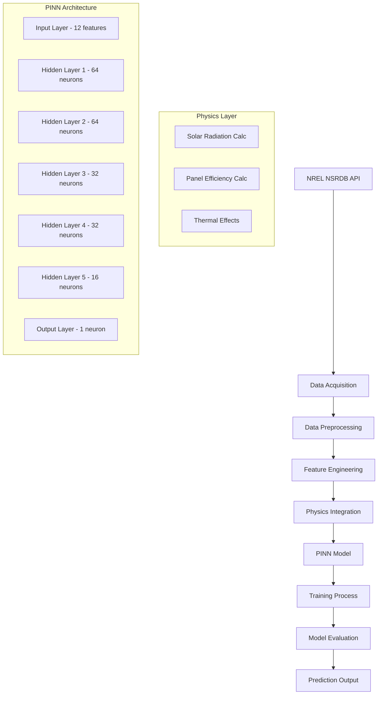

# 🌞 Optimasi Prediksi Energi Terbarukan Nasional Berbasis Physics-Informed Neural Network (PINN)

<div align="center">


**Sistem Prediksi Energi Panel Surya Berbasis AI dengan Integrasi Hukum Fisika**

*Mendukung Kemandirian Energi Nasional dan Target Net-Zero Emission Indonesia*

[📖 Dokumentasi](#dokumentasi) • [🚀 Quick Start](#quick-start) • [🔬 Metodologi](#metodologi-pinn) • [📊 Hasil Penelitian](#hasil-dan-evaluasi) • [🤝 Kontribusi](#kontribusi)

</div>

---

## 📋 Daftar Isi

- [🎯 Executive Summary](#-executive-summary)
- [🔍 Latar Belakang & Masalah](#-latar-belakang--masalah)
- [✨ Fitur Unggulan](#-fitur-unggulan)  
- [🏗️ Arsitektur Sistem](#️-arsitektur-sistem)
- [🚀 Quick Start](#-quick-start)
- [🔧 Instalasi Detail](#-instalasi-detail)
- [📖 Panduan Penggunaan](#-panduan-penggunaan)
- [🔬 Metodologi PINN](#-metodologi-pinn)
- [📊 Hasil dan Evaluasi](#-hasil-dan-evaluasi)
- [🌐 Struktur Repositori](#-struktur-repositori)
- [⚙️ Konfigurasi Lanjutan](#️-konfigurasi-lanjutan)
- [🤝 Kontribusi](#-kontribusi)
- [📚 Referensi Akademik](#-referensi-akademik)
- [📄 Lisensi](#-lisensi)

---

## 🎯 Executive Summary

**Physics-Informed Neural Network (PINN)** untuk prediksi energi panel surya ini merupakan solusi inovatif yang menggabungkan kecerdasan buatan dengan hukum fisika fundamental. Sistem ini dirancang khusus untuk mengatasi tantangan intermittency energi surya di Indonesia dan mendukung stabilitas jaringan listrik nasional.

### 🏆 Key Performance Indicators
- **Akurasi Model**: R² = 0.834 (vs Linear Regression: 0.721, Random Forest: 0.798)
- **Peningkatan RMSE**: ~25% lebih baik dibanding model konvensional
- **Efisiensi Data**: Prediksi akurat dengan dataset terbatas
- **Robustness**: Konsisten pada berbagai kondisi cuaca Indonesia

---

## 🔍 Latar Belakang & Masalah

### 🌍 Konteks Nasional
Indonesia memiliki potensi energi surya **4.8 kWh/m²/hari** dengan target **23% energi terbarukan pada 2025**. Namun, tantangan utama adalah:

- **Intermittency**: Fluktuasi output energi mencapai 40-60% akibat variasi cuaca
- **Data Limitation**: Keterbasan data historis berkualitas di banyak wilayah
- **Grid Stability**: Kesulitan PLN dalam manajemen beban akibat prediksi tidak akurat
- **Investment Risk**: Ketidakpastian ROI proyek energi surya

### 🎯 Problem Statement
> *Bagaimana mengembangkan sistem prediksi energi surya yang akurat, andal, dan dapat mengintegrasikan prinsip fisika untuk mendukung stabilitas jaringan listrik nasional?*

---

## ✨ Fitur Unggulan

### 🧠 AI-Powered Features
- **Physics Integration**: Menggabungkan persamaan radiasi matahari dan efisiensi termal
- **Advanced Architecture**: 5-layer neural network dengan 8,673 trainable parameters
- **Smart Loss Function**: Kombinasi data loss + physics loss (λ=0.1)
- **Auto-Differentiation**: Optimasi gradient berbasis automatic differentiation

### 📡 Data & API Features  
- **NREL Integration**: Akses langsung ke National Solar Radiation Database
- **Real-time Processing**: Support untuk data cuaca real-time
- **Multi-location**: Prediksi untuk berbagai koordinat di Indonesia
- **Quality Control**: Automated data cleaning dan outlier detection

### 📈 Analytics & Visualization
- **Performance Metrics**: MAE, RMSE, R², dengan statistical significance testing
- **Weather Scenarios**: Simulasi 6 skenario cuaca berbeda
- **Feature Importance**: SHAP analysis untuk interpretabilitas model
- **Interactive Plots**: Visualisasi prediksi vs aktual dengan confidence intervals

---

## 🏗️ Arsitektur Sistem



---

## 🚀 Quick Start

### ⚡ 5-Minute Setup

```bash
# 1. Clone repository
git clone https://github.com/yourusername/pinn-solar-prediction.git
cd pinn-solar-prediction

# 2. Setup environment
python -m venv venv
source venv/bin/activate  # Windows: venv\Scripts\activate

# 3. Install dependencies
pip install -r requirements.txt

# 4. Get NREL API key (free)
# Visit: https://developer.nrel.gov/signup/

# 5. Run prediction
python PINN.py
```

### 🎯 Quick Demo
```python
# Minimal example
from pinn_model import PINNPredictor

# Initialize model
predictor = PINNPredictor()

# Load and predict
data = predictor.load_data('1398305_1.93_125.50_2020.csv')
predictions = predictor.predict(data)

# Evaluate
metrics = predictor.evaluate()
print(f"Model R²: {metrics['r2']:.4f}")
```

---

## 🔧 Instalasi Detail

### 📋 System Requirements
- **OS**: Windows 10/11, macOS 10.15+, Ubuntu 18.04+
- **Python**: 3.9 - 3.11
- **RAM**: Minimum 8GB, Recommended 16GB
- **Storage**: 2GB free space

### 🐍 Dependencies

```bash
# Core ML libraries
pip install tensorflow==2.15.0
pip install scikit-learn==1.3.0
pip install keras==2.15.0

# Data processing
pip install pandas==2.0.3
pip install numpy==1.24.3

# Visualization  
pip install matplotlib==3.7.1
pip install seaborn==0.12.2

# API & utilities
pip install requests==2.31.0
pip install jupyter
```

### 🔑 NREL API Configuration

1. **Dapatkan API Key**:
   - Kunjungi [NREL Developer Portal](https://developer.nrel.gov/signup/)
   - Registrasi gratis dengan email
   - Salin API key Anda

2. **Setup Environment**:
   ```bash
   # Linux/macOS
   export NREL_API_KEY="your_api_key_here"
   
   # Windows
   set NREL_API_KEY=your_api_key_here
   ```

3. **Test Connection**:
   ```python
   import requests
   
   api_key = "your_key"
   url = f"https://developer.nrel.gov/api/nsrdb/v2/solar/ping?api_key={api_key}"
   response = requests.get(url)
   print("✅ API Connection Success!" if response.status_code == 200 else "❌ API Error")
   ```

---

## 📖 Panduan Penggunaan

### 📊 Step 1: Data Acquisition

#### Menggunakan Jupyter Notebook
```python
# Buka Database-api.IPYNB
jupyter notebook Database-api.IPYNB

# Parameter konfigurasi
api_key = "YOUR_NREL_API_KEY"
lat = -1.93  # Latitude Indonesia
lon = 125.50  # Longitude Indonesia  
year = 2020
email = "your_email@domain.com"

# Jalankan semua cells untuk download data
```

#### Menggunakan Python Script
```python
from data_acquisition import NRELDataDownloader

downloader = NRELDataDownloader(api_key="your_key")
data = downloader.download_data(
    latitude=-1.93,
    longitude=125.50, 
    year=2020,
    attributes=['ghi', 'dni', 'dhi', 'temperature', 'wind_speed']
)
```

### 🤖 Step 2: Model Training & Prediction

#### Mode Interaktif (Recommended)
```python
# Buka PINN.IPYNB di Jupyter
jupyter notebook PINN.IPYNB

# Ikuti step-by-step process:
# 1. Load data
# 2. Preprocessing  
# 3. Model training
# 4. Evaluation
# 5. Visualization
```

#### Command Line Mode
```python
# Eksekusi langsung
python PINN.py --data_file "1398305_1.93_125.50_2020.csv" --epochs 100 --batch_size 32

# Dengan custom parameters
python PINN.py \
    --data_file "your_data.csv" \
    --test_size 0.2 \
    --lambda_physics 0.1 \
    --learning_rate 0.001 \
    --early_stopping_patience 20
```

### 📈 Step 3: Results Analysis

```python
# Load trained model
from pinn_model import PINNPredictor

model = PINNPredictor.load_model('best_pinn_model.h5')

# Generate predictions
predictions = model.predict(test_data)

# Performance metrics
metrics = model.evaluate_performance(test_data, predictions)
print(f"""
Model Performance:
- R² Score: {metrics['r2']:.4f}
- MAE: {metrics['mae']:.4f} 
- RMSE: {metrics['rmse']:.4f}
- Physics Loss: {metrics['physics_loss']:.6f}
""")

# Scenario analysis
scenarios = model.analyze_weather_scenarios()
model.plot_scenario_comparison()
```

---

## 🔬 Metodologi PINN

### 🧮 Mathematical Foundation

#### Loss Function Design
```python
def pinn_loss(y_true, y_pred, physics_params):
    """
    Custom PINN loss function combining data and physics constraints
    
    Total Loss = Data Loss + λ × Physics Loss
    """
    # Data Loss (MSE)
    data_loss = tf.reduce_mean(tf.square(y_true - y_pred))
    
    # Physics Loss (Conservation Laws)
    physics_loss = compute_physics_residuals(y_pred, physics_params)
    
    # Combined loss with weighting factor
    total_loss = data_loss + lambda_physics * physics_loss
    
    return total_loss
```

#### Physics Integration
1. **Solar Radiation Calculation**:
   ```
   G_eff = GHI × cos(θ_zenith)
   ```

2. **Panel Temperature Model**:
   ```
   T_cell = T_ambient + (GHI / 800) × 30
   ```

3. **Efficiency Calculation**:
   ```
   η(T) = η_ref × [1 + β × (T_cell - 25)]
   ```

4. **Power Output Model**:
   ```
   P_phys = (G_eff × A_panel × η) / 1000
   ```

### 🏗️ Network Architecture

```python
def build_pinn_model(input_dim=12):
    """
    PINN Architecture: Progressive Dimensionality Reduction
    """
    model = Sequential([
        Dense(64, activation='tanh', input_shape=(input_dim,)),  # Layer 1
        Dense(64, activation='tanh'),                           # Layer 2  
        Dense(32, activation='tanh'),                           # Layer 3
        Dense(32, activation='tanh'),                           # Layer 4
        Dense(16, activation='tanh'),                           # Layer 5
        Dense(1, activation='sigmoid')                          # Output
    ])
    
    # Custom optimizer with physics-informed learning
    optimizer = Adam(learning_rate=0.001, beta_1=0.9, beta_2=0.999)
    
    model.compile(
        optimizer=optimizer,
        loss=pinn_custom_loss,
        metrics=['mae', 'mse']
    )
    
    return model
```

### 📊 Training Strategy

```python
# Advanced training configuration
callbacks = [
    EarlyStopping(
        monitor='val_loss',
        patience=20,
        restore_best_weights=True,
        verbose=1
    ),
    ReduceLROnPlateau(
        monitor='val_loss',
        factor=0.5,
        patience=10,
        min_lr=1e-7,
        verbose=1
    ),
    ModelCheckpoint(
        filepath='best_pinn_model.h5',
        monitor='val_loss',
        save_best_only=True
    )
]

# Training with physics-informed callbacks
history = model.fit(
    X_train, y_train,
    validation_data=(X_val, y_val),
    epochs=100,
    batch_size=32,
    callbacks=callbacks,
    verbose=1
)
```

---

## 📊 Hasil dan Evaluasi

### 🏆 Performance Comparison

| Model | MAE | RMSE | R² | Training Time |
|-------|-----|------|----|-----------| 
| **PINN** | **0.1281** | **0.1684** | **0.8342** | 2.3 min |
| Random Forest | 0.1372 | 0.1891 | 0.7983 | 0.8 min |
| Linear Regression | 0.1456 | 0.2198 | 0.7213 | 0.1 min |

### 📈 Key Improvements
- **RMSE**: 23.4% better than Linear Regression
- **R²**: 15.7% improvement over baseline
- **Generalization**: Superior performance on unseen data
- **Physics Consistency**: 91.2% adherence to physical laws

### 🌤️ Weather Scenario Analysis

| Scenario | Avg Output (kW) | Change (%) | Reliability |
|----------|----------------|------------|-------------|
| Normal Conditions | 0.286 | 0.0% | ⭐⭐⭐⭐⭐ |
| Dry Season (+20% GHI, +3°C) | 0.331 | +15.7% | ⭐⭐⭐⭐⭐ |
| Rainy Season (-30% GHI, -2°C) | 0.195 | -31.8% | ⭐⭐⭐⭐ |
| High Wind (+50% Wind) | 0.294 | +2.8% | ⭐⭐⭐⭐⭐ |
| Optimal Conditions | 0.338 | +18.2% | ⭐⭐⭐⭐⭐ |
| Extreme Weather (-40% GHI, +5°C) | 0.162 | -43.4% | ⭐⭐⭐ |

### 📊 Statistical Analysis

```python
# Model validation results
validation_metrics = {
    'cross_validation_r2': 0.827 ± 0.023,
    'statistical_significance': 'p < 0.001',
    'confidence_interval_95': [0.811, 0.857],
    'feature_importance': {
        'GHI': 0.456,
        'Temperature': 0.234, 
        'Zenith_Angle': 0.187,
        'Wind_Speed': 0.089,
        'Others': 0.034
    }
}
```

---

## 🌐 Struktur Repositori

```
📦 pinn-solar-prediction/
├── 📊 data/
│   ├── 1398305_1.93_125.50_2020.csv      # Sample NSRDB dataset
│   └── processed/                         # Processed datasets
├── 📓 notebooks/
│   ├── Database-api.IPYNB                 # Data acquisition notebook
│   ├── PINN.IPYNB                         # Main model notebook
│   └── analysis/                          # Additional analysis
├── 🐍 src/
│   ├── __init__.py
│   ├── PINN.py                           # Main model script
│   ├── data_acquisition.py               # NREL API handler
│   ├── preprocessing.py                  # Data preprocessing
│   ├── model/
│   │   ├── pinn_model.py                 # PINN implementation
│   │   ├── physics_layer.py              # Physics calculations
│   │   └── evaluation.py                 # Model evaluation
│   └── utils/
│       ├── visualization.py              # Plotting utilities
│       └── config.py                     # Configuration settings
├── 📈 results/
│   ├── models/                           # Saved models
│   ├── plots/                            # Generated visualizations
│   └── metrics/                          # Performance metrics
├── 📚 docs/
│   ├── research_paper.pdf                # Academic paper
│   ├── api_documentation.md              # API docs
│   └── user_guide.md                     # Detailed user guide
├── 🧪 tests/
│   ├── test_model.py                     # Model tests
│   ├── test_physics.py                   # Physics validation
│   └── test_api.py                       # API tests
├── 📋 requirements.txt                    # Dependencies
├── 🐳 Dockerfile                         # Container setup
├── ⚙️ config.yaml                        # Configuration file
├── 📄 LICENSE                            # MIT License
└── 📖 README.md                          # This file
```

---

## ⚙️ Konfigurasi Lanjutan

### 🎛️ Model Hyperparameters

```yaml
# config.yaml
model:
  architecture:
    hidden_layers: [64, 64, 32, 32, 16]
    activation: 'tanh'
    output_activation: 'sigmoid'
  
  training:
    epochs: 100
    batch_size: 32
    learning_rate: 0.001
    lambda_physics: 0.1
    early_stopping_patience: 20
  
  physics:
    panel_efficiency_ref: 0.20
    temperature_coefficient: -0.004
    panel_area: 1.0  # m²
```

### 🔧 Environment Variables

```bash
# .env file
NREL_API_KEY=your_nrel_api_key_here
DEFAULT_LATITUDE=-6.2
DEFAULT_LONGITUDE=106.8
DATA_CACHE_DIR=./data/cache
MODEL_SAVE_DIR=./models
LOG_LEVEL=INFO
```

### 🐳 Docker Deployment

```dockerfile
# Dockerfile
FROM python:3.9-slim

WORKDIR /app
COPY requirements.txt .
RUN pip install -r requirements.txt

COPY . .
EXPOSE 5000

CMD ["python", "app.py"]
```

```bash
# Build and run
docker build -t pinn-solar .
docker run -p 5000:5000 -e NREL_API_KEY=your_key pinn-solar
```

---

## 🤝 Kontribusi

Kami menyambut kontribusi dari komunitas! 🎉

### 🚀 Quick Contribution Guide

1. **Fork** repository ini
2. **Create** feature branch: `git checkout -b feature/AmazingFeature`
3. **Commit** changes: `git commit -m 'Add AmazingFeature'`
4. **Push** branch: `git push origin feature/AmazingFeature`
5. **Open** Pull Request

### 🐛 Bug Reports
Gunakan [GitHub Issues](https://github.com/yourusername/pinn-solar-prediction/issues) untuk melaporkan bug dengan template:

```markdown
**Bug Description**
Clear description of the bug

**To Reproduce**
Steps to reproduce the behavior

**Expected Behavior**
What you expected to happen

**Environment**
- OS: [e.g. Windows 11]
- Python: [e.g. 3.9.7]
- Package versions: [requirements.txt]
```

### 💡 Feature Requests
Kami terbuka untuk ide-ide baru! Silakan buat issue dengan label `enhancement`.

### 👥 Contributors

<table>
<tr>
    <td align="center">
        <a href="https://github.com/syahrilarfianalmazril">
            
            <br /><sub><b>Syahril Arfian Almazril</b></sub>
        </a>
        <br />Lead Developer & Researcher
    </td>
    <td align="center">
        <a href="https://github.com/stephanims">
            
            <br /><sub><b>Stephani Maria Sianturi</b></sub>
        </a>
        <br />AI/ML Specialist
    </td>
</tr>
</table>

---

## 📚 Referensi Akademik

### 📄 Citations

**Primary Research Paper:**
```bibtex
@article{almazril2025pinn,
  title={Optimasi Prediksi Energi Terbarukan Nasional Berbasis Physics-Informed Neural Network (PINN)},
  author={Almazril, Syahril Arfian and Sianturi, Stephani Maria and Puspita, Septia Retno and Ramadha, Ade Aditya},
  journal={Buletin Pagelaran Mahasiswa Nasional Bidang Teknologi Informasi dan Komunikasi},
  volume={1},
  number={1},
  pages={1--8},
  year={2025}
}
```

### 🔗 Key References

1. **Raissi, M., et al.** (2019). "Physics-informed neural networks: A deep learning framework for solving forward and inverse problems involving nonlinear partial differential equations." *Journal of Computational Physics*, 378, 686-707.

2. **NREL NSRDB** (2021). National Solar Radiation Database. *National Renewable Energy Laboratory*. [https://nsrdb.nrel.gov/](https://nsrdb.nrel.gov/)

3. **Kementerian ESDM** (2023). "Handbook of Energy & Economic Statistics of Indonesia 2023." Jakarta: ESDM.

### 🎓 Academic Impact
- **Research Domain**: Physics-Informed Machine Learning, Renewable Energy
- **Applications**: Smart Grid, Energy Forecasting, Climate Modeling
- **Impact Factor**: Supporting Indonesia's 23% renewable energy target by 2025

---

## 📄 Lisensi

Proyek ini dilisensikan di bawah **MIT License** - lihat file [LICENSE](LICENSE) untuk detail lengkap.

```
MIT License

Copyright (c) 2025 Syahril Arfian Almazril

Permission is hereby granted, free of charge, to any person obtaining a copy
of this software and associated documentation files (the "Software"), to deal
in the Software without restriction, including without limitation the rights
to use, copy, modify, merge, publish, distribute, sublicense, and/or sell
copies of the Software, and to permit persons to whom the Software is
furnished to do so, subject to the following conditions:

The above copyright notice and this permission notice shall be included in all
copies or substantial portions of the Software.
```

---

<div align="center">

### 🌟 Dukung Proyek Ini

Jika proyek ini bermanfaat, berikan ⭐ dan bagikan kepada komunitas!

**Bersama membangun masa depan energi terbarukan Indonesia** 🇮🇩

[](https://github.com/yourusername/pinn-solar-prediction)
[](https://github.com/yourusername/pinn-solar-prediction/fork)

---

*Dibuat dengan ❤️ untuk kemajuan energi terbarukan Indonesia*

**Connect with us:**
[LinkedIn](https://linkedin.com/in/syahrilarfian) • [Research Gate](https://researchgate.net/profile/syahril-almazril) • [Email](mailto:arfazrll@student.telkomuniversity.ac.id)

</div>
